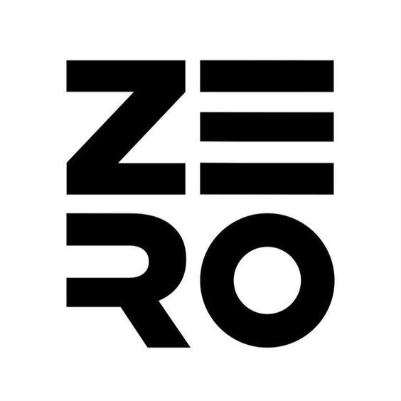
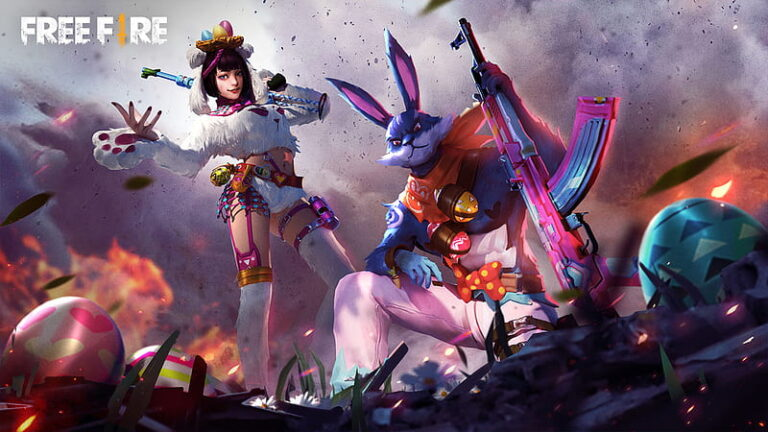
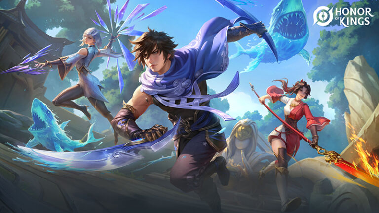
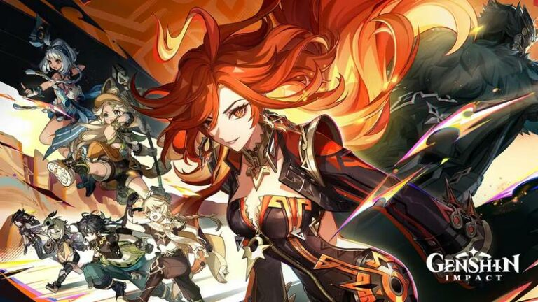
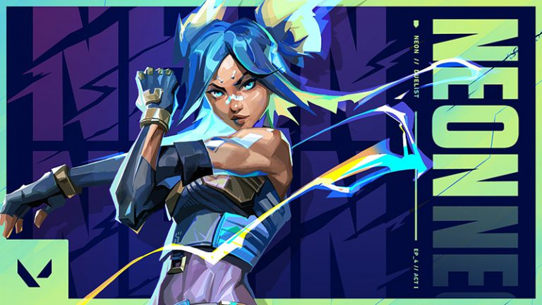
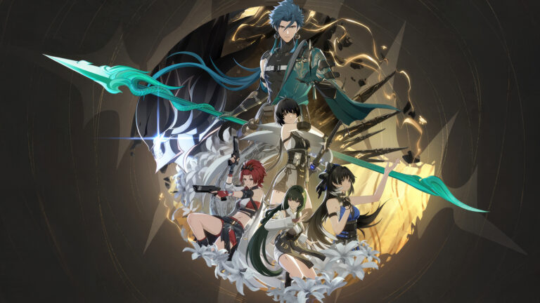

<!DOCTYPE html>
<html lang="en">

<head>
  <meta charset="UTF-8">
  <meta name="viewport" content="width=device-width, initial-scale=1.0">
  <meta http-equiv="X-UA-Compatible" content="ie=edge">
  <title>zeroStore</title>
  <link href="https://cdn.jsdelivr.net/npm/bootstrap@5.3.0-alpha1/dist/css/bootstrap.min.css" rel="stylesheet">
  <link rel="stylesheet" href="https://cdnjs.cloudflare.com/ajax/libs/bootstrap-icons/1.5.0/font/bootstrap-icons.min.css">
  <link rel="stylesheet" href="styles.css"> <!-- Link ke file CSS eksternal -->
</head>

<body>

  <!-- Navbar -->
<nav class="navbar navbar-expand-lg navbar-dark bg-black">
  

    <!-- Navbar -->
<nav class="navbar navbar-expand-lg navbar-dark bg-black">
  

    <a class="navbar-brand" href="#">
      
      zeroStore
    </a>
    <!-- Sisa kode navbar tetap sama -->
  

</nav>
</a>
    <button class="navbar-toggler" type="button" data-bs-toggle="collapse" data-bs-target="#navbarNav" aria-controls="navbarNav" aria-expanded="false" aria-label="Toggle navigation">
      
    </button>
    

      <ul class="navbar-nav me-auto">
        <li class="nav-item">
          <a class="nav-link active" href="#home">Home</a>
        </li>
        <li class="nav-item">
          <a class="nav-link" href="#produk">Produk</a>
        </li>
        <li class="nav-item">
          <a class="nav-link" href="#caratopup">cara topup</a>
        </li>
        <li class="nav-item">
          <a class="nav-link" href="#layanan">Layanan</a>
        </li>
        <li class="nav-item">
          <a class="nav-link" href="#kontak">Kontak</a>
        </li>
      </ul>

      <!-- Search Bar -->
      <form class="d-flex" role="search">
        <input class="form-control me-2" type="search" placeholder="Cari produk" aria-label="Search">
        <button class="btn btn-outline-light" type="submit">Search</button>
      </form>
    

  

</nav>

  <!-- Hero Section -->
  <section id="home" class="hero d-flex align-items-center text-center text-white">
    

      <h1>Top Up Game Favorits Anda</h1>
      
zeroStore menawarkan tempat terbaik dan tercepat untuk top-up berbagai game populer

      <a href="#produk" class="btn btn-primary btn-lg mt-3">Mulailah Sekarang</a>
    

  </section>

  <!-- Produk Section -->
  <section id="produk" class="produk py-5">
    

      <h2 class="text-center mb-5">Produk Top-Up Game</h2>
      

        

          

            
            

              <h5 class="card-title">Mobile Legends</h5>
              
Top-up cepat aman untuk Diamond Mobile Legends.

              <a href="#" class="btn btn-primary">Top Up Sekarang</a>
            

          

        

        

          

            
            

              <h5 class="card-title">PUBG Mobile</h5>
              
Top-up UC PUBG Mobile dengan harga terbaik disini.

              <a href="#" class="btn btn-primary">Top Up Sekarang</a>
            

          

        

        

          

            
            

              <h5 class="card-title">Free Fire</h5>
              
Top-up Diamond Free Fire cepat dan aman disini.

              <a href="#" class="btn btn-primary">Top Up Sekarang</a>
            

          

        

        

            

              
              

                <h5 class="card-title">Honor of King</h5>
                
Top-up Honor of King amanah dan cepat disini.

            <a href="#" class="btn btn-primary">Top Up Sekarang</a>
          

        

      

      

          

            
            

              <h5 class="card-title">Genshin Impact</h5>
              
Top-up Genesis Crystals dan Welkin Moon disini.

          <a href="#" class="btn btn-primary">Top Up Sekarang</a>
        

      

    

    

        

          
          

            <h5 class="card-title">Valorant</h5>
            
Top-up Valorant Point cepat disini.

        <a href="#" class="btn btn-primary">Top Up Sekarang</a>
      

    

  

  

      

        
        

          <h5 class="card-title">wuthering waves </h5>
          
Top-up cheap Wuthering Waves Lunites cepat disini.

      <a href="#" class="btn btn-primary">Top Up Sekarang</a>
    

  

    

      
      

        <h5 class="card-title">Apex Legend</h5>
        
Top-up Apex Coins cepat disini.

    <a href="#" class="btn btn-primary">Top Up Sekarang</a>
  

  

    
    

      <h5 class="card-title">call of duty mobile </h5>
      
Top-up CP CODM mudah disini.

  <a href="#" class="btn btn-primary">Top Up Sekarang</a>
      

    

  </section>

  <!-- Layanan Section -->
  <section id="layanan" class="layanan bg-dark py-5">
    <!-- Cara Top Up Section -->
<section id="caratopup" class="cara-topup bg-dark text-white py-5">
  

    <h2 class="text-center mb-4">Cara Top Up</h2>
    

      

        

          <i class="bi bi-cart-plus-fill display-4"></i>
        

        <h5>Pilih Produk</h5>
        
Pilih game yang ingin Anda top-up dari daftar produk kami yang lengkap.

      

      

        

          <i class="bi bi-wallet-fill display-4"></i>
        

        <h5>Masukkan Detail Pembayaran</h5>
        
Masukkan ID pengguna game Anda dan pilih metode pembayaran yang diinginkan.

      

      

        

          <i class="bi bi-check-circle-fill display-4"></i>
        

        <h5>Selesaikan Transaksi</h5>
        
Setelah pembayaran berhasil, diamond atau mata uang game akan otomatis masuk.

      

    

  

</section>

    

      <h2 class="text-center mb-5">Layanan Kami</h2>
      

        

          

            <i class="bi bi-shield-check display-4"></i>
            <h4>Aman dan Terpercaya</h4>
            
Transaksi top-up dengan keamanan tinggi dan layanan cepat yang terpercaya.

          

        

        

          

            <i class="bi bi-clock display-4"></i>
            <h4>Proses Cepat</h4>
            
Proses pengisian yang cepat dan mudah, langsung ke akun game Anda.

          

        

        

          

            <i class="bi bi-credit-card display-4"></i>
            <h4>Beragam Metode Pembayaran</h4>
            
Support berbagai metode pembayaran untuk kenyamanan Anda.

          

        

      

    

  </section>

  <!-- Kontak Section -->
  <section id="kontak" class="kontak py-5">
    

      <h2 class="text-center mb-4">Kontak Kami</h2>
      

        

          <form>
            

              <label for="name" class="form-label">Nama</label>
              <input type="text" class="form-control" id="name" placeholder="Nama Anda">
            

            

              <label for="email" class="form-label">Email</label>
              <input type="email" class="form-control" id="email" placeholder="Email Anda">
            

            

              <label for="message" class="form-label">Pesan</label>
              <textarea class="form-control" id="message" rows="4" placeholder="Pesan Anda"></textarea>
            

            <button type="submit" class="btn btn-primary">Kirim Pesan</button>
          </form>
        

      

    

  </section>

  
</body>

</html>
